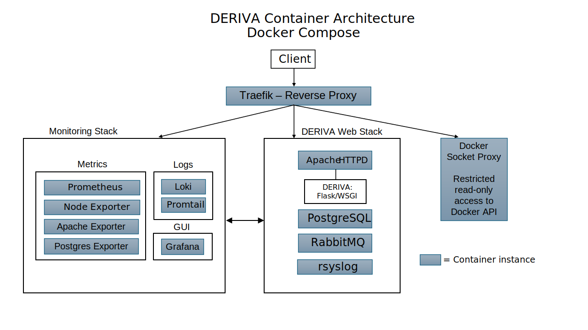

# Containerized DERIVA 

This project provides a fully containerized deployment of the [DERIVA platform](https://www.isi.edu/isr/research-areas/the-deriva-platform/), including core web services, database, message broker, logging, and monitoring — all orchestrated using Docker Compose.

---

## Architecture



**Overview**  
- **Web Stack** 
  - Includes individual containers for Apache HTTPD (serving DERIVA Flask/WSGI apps), PostgreSQL, RabbitMQ, and centralized **rsyslog** logging.  
- **Monitoring Stack** 
  - Uses multiple containers to aggregate metrics (via Prometheus and exporters) and logs (via Promtail and Loki), all visualized through Grafana Web UI.  
- **Traefik Reverse Proxy** 
  - Securely routes external HTTPS traffic to internal services via path-based routing.
  - Supports both static and dynamic (via via LetsEncrypt) TLS certificate configuration.
  - Traefik’s access to Docker API is restricted to read-only via a specialized Docker Socket Proxy container.  
- **Internal Networking** 
  - Isolates service communication within Docker, exposing only controlled endpoints via Traefik. 
  - Inter-container communication is handled via a combination of Unix sockets, TCP, and shared access to specific filesystem volumes.  
- **Security** 
  - Is enforced through single-container external port exposure (via Traefik reverse proxy, HTTPS-only), automated TLS certificates, restricted Docker API access, and private internal-only service ports.

---

## Container Instance Details

| Container             | Description                                                       |
|-----------------------|-------------------------------------------------------------------|
| **Apache (HTTPD)**    | HTTPD serving DERIVA WSGI apps                                    |
| **PostgreSQL**        | Metadata and relational data store                                |
| **RabbitMQ**          | Message broker for event notification                             |
| **Rsyslog**           | Container-based system logging                                    |
| **Traefik**           | TLS-enabled reverse proxy with optional Let's Encrypt integration |
| **Socket Proxy**      | Restricts Docker socket access for Traefik                        |
| **Prometheus**        | Metrics collection for services                                   |
| **Node Exporter**     | Exports host system metrics to Prometheus                         |
| **Apache Exporter**   | Exports Apache metrics to Prometheus                              |
| **Postgres Exporter** | Exports Postgres metrics to Prometheus                            |
| **Grafana**           | Dashboards for monitoring metrics and logs                        |
| **Loki**              | Centralized log aggregation                                       |
| **Promtail**          | Tails and ships log information to Loki                           |

---

## ️ Getting Started

### Prerequisites

- Docker (v20+)
- Docker Compose (v2.15+)

**Or**

- Docker Desktop (recommended for developers)

---

## Quickstart

### Setup Environment

Use the provided `utils/generate_env.sh` script to generate one or more `.env` files. The `env` file is a set of parameters 
that are used to control both the composition (i.e., one or more Docker Compose profiles) of the container stack and certain 
aspects of each container's runtime configuration.

```bash
./utils/generate_env.sh
```

Invoked without arguments, the command above will generate an environment-specific `localhost.env` config file, located at `~/.deriva-docker/env/localhost.env`, using the 
`test` environment profile. This profile includes the entire container stack, including test users (using the `webauthn` database provider) and a 
test catalog #1 running under the hostname `localhost`.

##### User credentials (Test profile):

| Account Type | Username         | Password     |
|--------------|------------------|--------------|
| Admin        | **deriva-admin** | deriva-admin |
| User         | **deriva**       | deriva       |


### Add the `deriva/certs/deriva-dev-ca.crt` CA certificate to your OS trust store. 
This step is recommended (but functionally optional) when running the container stack on `localhost`, as the container stack will use a 
certificate issued by the DERIVA DevOps `deriva-dev` certificate authority. Installing the CA certificate will avoid browser 
certificate invalidity warnings for certificates issued by this CA.

#### Linux (Debian/Ubuntu):
```bash
    sudo cp ./deriva/certs/deriva-dev-ca.crt /usr/local/share/ca-certificates/deriva-dev-ca.crt && sudo update-ca-certificates
```

#### Linux (Fedora/RHEL):
```bash
    sudo cp ./deriva/certs/deriva-dev-ca.crt /etc/pki/ca-trust/source/deriva-dev-ca.crt && sudo update-ca-trust
```

#### MacOS:
```bash
    sudo security add-trusted-cert -d -r trustRoot -k /Library/Keychains/System.keychain ./deriva/certs/deriva-dev-ca.crt
```

#### Windows:

Click on the CA certificate file in Windows Explorer and follow the Certificate Installation Wizard prompts, using all default/suggested settings.

---
### Working with the Container Stack

The following `docker compose` commands are meant to be executed from the Docker Compose project root: `deriva-docker/deriva`.

```bash
cd deriva
```

#### Start the Stack:

```bash
docker compose --env-file ~/.deriva-docker/env/localhost.env up
```
You can append `-d` to the above command to detach and run the stack in the background.

#### Test the Stack:
Visit `https://localhost` to verify functionality. The landing page will contain some basic links that can be used as entry points for further testing.

#### Stop the Stack:

```bash
docker compose --env-file ~/.deriva-docker/env/localhost.env stop
```
If you ran the stack without detaching (i.e., without `-d`), you can simply `ctrl-c` to stop the stack.

Note you can also use `pause` and `unpause` to temporarily halt the container stack. Resuming from `pause` is fast and  can be useful when you want to disable the containers but then restart them quickly.
#### Delete the Stack (and optionally, associated volumes):
```bash
docker compose --env-file ~/.deriva-docker/env/localhost.env down
```
You can append the `-v` argument (after `down`) to also delete the container volume mounts. 
Note that deleting the volume mounts will destroy any persistent state that has been created, e.g. Postgres databases, Hatrac files at `/var/www/hatrac`, etc.


---

## TLS Support

- Self-signed development certificates (auto-generated if missing)
- Trusted development certificates via an installable DERIVA Development CA certificate
- Statically configured TLS certificates from external CAs.
- Dynamically configured TLS certificates using Let's Encrypt (via Traefik)

Configure TLS settings via the `CERT_FILENAME`, `KEY_FILENAME`, `CERT_DIR`, `CA_FILENAME` and `LETSENCRYPT_EMAIL` variables &#40;as appropriate&#41; in the environment file.

See the TLS [configuration guide](docs/TLS-config.md) for more information.

---

